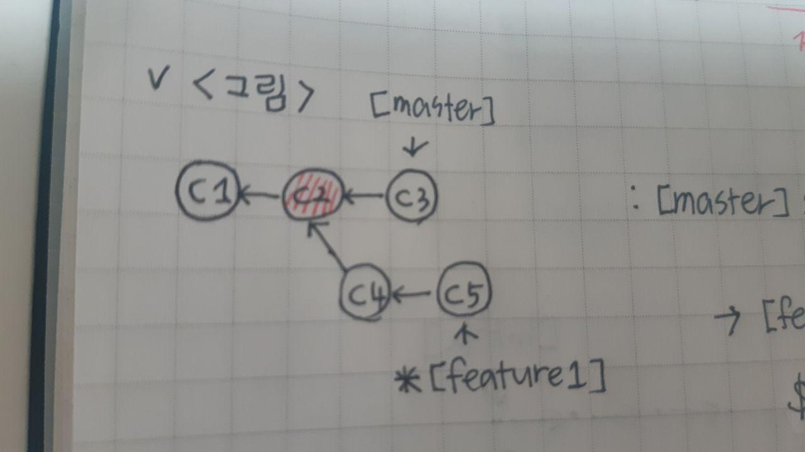
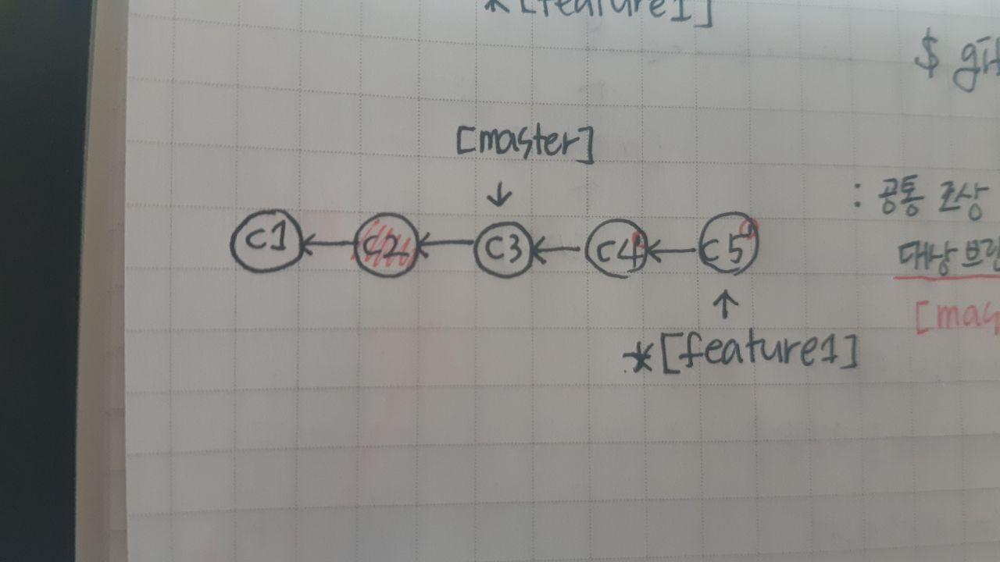
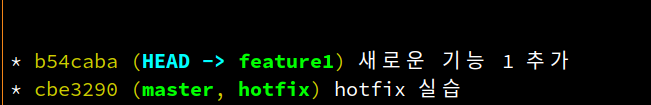
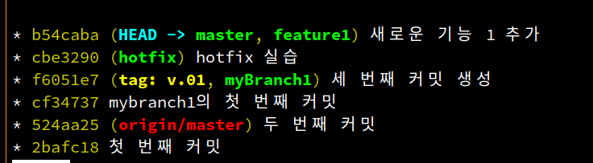

## 오늘의 할일

- [V] CLI로 rebase 해 보기

## 용어 정리

- rebase : 현재 브랜치의 커밋들을 재배치한다.
- rebase 사용하는 이유?
  : 브랜치를 병합할 때, 병합 커밋이 생긴다. 그러면 커밋 히스토리에 병합 커밋이 생긴다. 대신에 rebase를 사용하면 커밋 히스토리가 생기지 않는다. 보통 로컬 브랜치를 깔끔하게 정리하고 싶을 때 사용한다. 추가적으로 원격 저장소에 존재하는 브랜치에 대해서는 rebase를 하지 말 것을 권장한다.

## rebase 실습하기

- rebase의 원리

- 먼저 `HEAD`와 `대상 브랜치[master]`의 공통 조상을 찾는다. 아래의 그림에서 `C2` 커밋이 공통 조상이다.
  

- 공통 조상 이후에 생성된 커밋들(C4, C5)을 `[master]` 브랜치 뒤로 재배치한다.  
  

- 즉, `[feature1]` 브랜치에서 `git rebase master` 명령어를 수행할 경우, `[master]` 브랜치의 최신 커밋인 `C3` 다음으로 `[feature1]` 브랜치의 공통 조상 이후에 생성된 커밋들을 재배치한다. 추가적으로 재배치된 커밋은 이전에 `[feature1]`의 커밋들과는 전혀 다르다.(커밋의 커밋체크섬값을 확인해보면 알 수 있다.)

- rebase 해보기

- rebase 하기 전에 `[master]`와 `[feature1]`이 병합 커밋이 있기 때문에 `[feature1]`브랜치에서 `git reset --hard HEAD~` 명령어를 수행한다. 병합 커밋 전 커밋으로 되돌린다.
- 되돌린 상태에서 `git rebase master` 명령어를 수행한다. 여기서 충돌이 발생한다.
- 충돌을 해결한다. 그리고 변경 사항을 커밋에 대한 파일에 추가한다.
- `git rebase --continue` 명령어를 통해 리베이스를 다시 시도한다.
- 아래의 그림처럼 rebase가 되었다.  
  
- `[master]`브랜치로 이동하여 `git merge feature1` 명령을 통해 빨리 감기 병합을 수행한다.  
  

## 추가 정보

- rebase 경우, 충돌이 발생했다. 그러면 충돌을 수정하고, `git rebase --continue`명령어를 통해 리베이스가 다시 수행된다.

|      | 3-way 병합             | rebase                                             |
| ---- | ---------------------- | -------------------------------------------------- |
| 특징 | 머지 커밋 생성         | 현재 커밋들을 수정하면서 대상 브랜치 위로 재배치함 |
| 장점 | 한 번만 충돌 생성      | 깔끔한 히스토리                                    |
| 단점 | 트리가 약간 지저분해짐 | 여러 번 충돌이 발생할 수 있음                      |

[ 출처 도서 팀 개발을 위한 Git, Github 시작하기 ]
