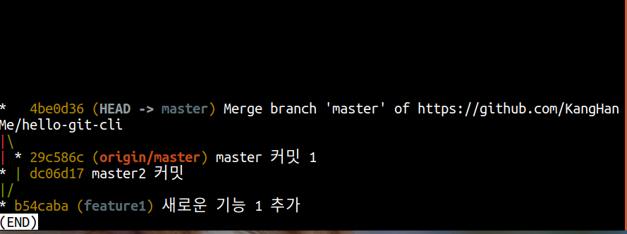
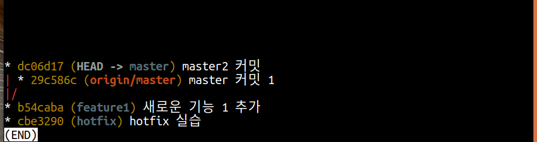
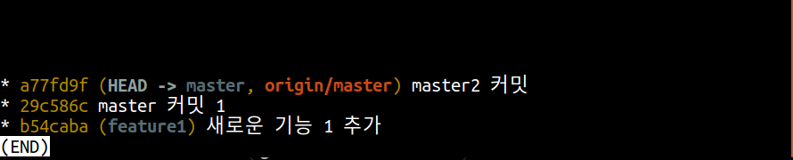

## 오늘의 할일

- [v] 뻗어나온 브랜치 없애기
- [v] 임시 브랜치 사용하기

## 추가 정보

- `rebase` : 로컬저장소에서 `reabse` 명령어를 사용할 것을 권장한다. 즉, 원격저장소에 올린 브랜치를 `rebase`하지 않는 것이 원칙이다. 왜냐하면 `rebase`할 커밋이 기존 커밋과 다르다(커밋 체크섬 값이 다르다) 이때 다른 사용자가 원격에 있던 커밋을 병합한다면, `rebase`된 커밋도 언젠간 원격저장소에 올려진다. 그럼 원격저장소에 같은 내용의 커밋체크섬만 다른 커밋이 존재하게된다. 그 상황에서 다른 누군가가 충돌을 해결하기 위해서 병합과 `rebase`를 사용한다면, 커밋 히스토리가 꼬이기 시작할 것이다. `rebase`의 작동원리를 잘 이해하고 나서 사용하는 것을 권장한다.

## `rebase`를 이용한 뻗어나온 브랜치 없애기

- 위의 그림에서 `master 커밋 1` 커밋을 확인할 수 있다. 즉, 3-way 병합을 한 개의 브랜치로 만들어 보자. `[master]` 브랜치에서 `master 커밋 1`을 만들어서 원격저장소에 올린다. 그리로 다시 `git reset --hard HEAD~` 명령어를 수행한다. 그리고 `master 커밋 2`이라는 커밋을 만든다. 그리고 `git pull`을 하게 되면 병합 커밋이 생긴다. 그러면 위와 같이 커밋 히스토리가 지저분해진다. 깔끔한 커밋 히스토리를 위해 `git reset --hard HEAD~` 명령어를 통햬 병합 커밋을 되돌린다.

- `git rebase origin/master` 명령을 통해 원격저장소 커밋을 부모로 두는 `master2 커밋2`이라는 커밋을 재배치한다. 그리고 다시 원격저장소에 올린다. 아래의 그림에 커밋 히스토리를 확인할 수 있다.

## 임시 브랜치 사용하기

- Git을 통해 충돌 해결, 병합, 리베이스 등을 이용할 때, 혹시나 기존의 소스코드가 꼬이거나 날라가버리지 않을까 하는 두려움이 있을 수 있다. 원래 작업하려고 했던 브랜치의 커밋으로 임시 브랜치를 만들어서 충돌 해결, 커밋, 병합, 리베이스를 테스트 해볼 수 있다. 그리고 필요에 따라서 임시 브랜치를 삭제하면, 모든 내용이 원상 복구가 된다.
