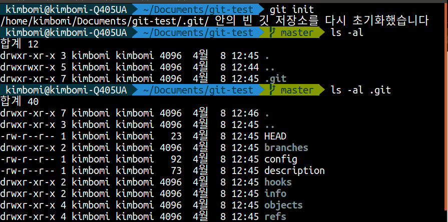
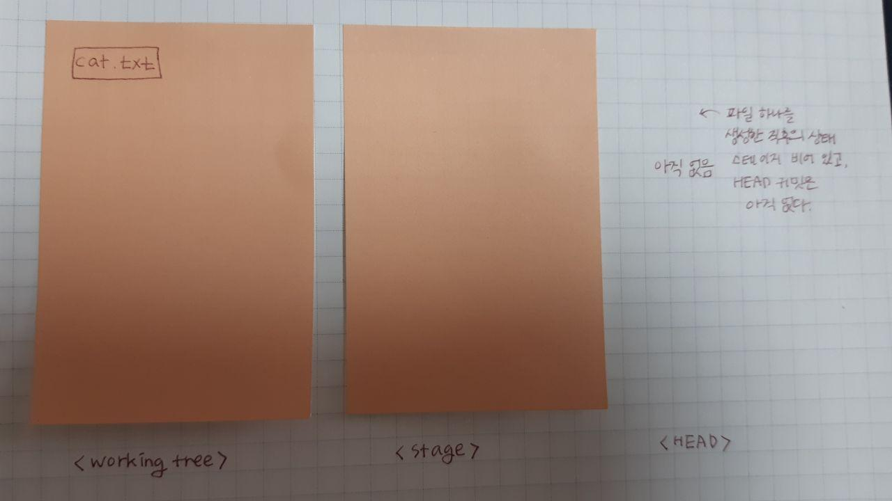
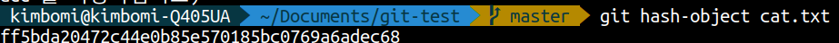
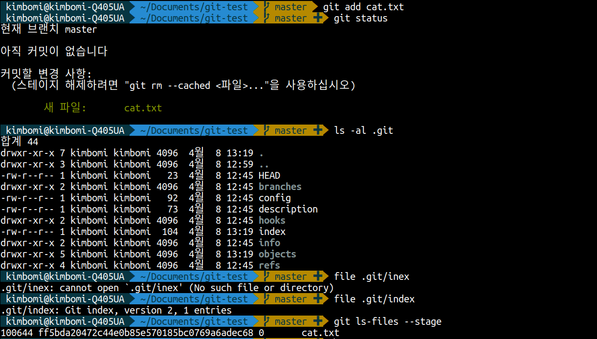
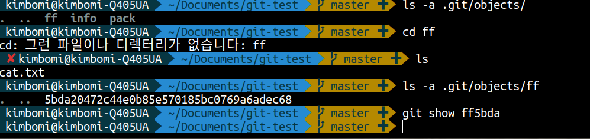
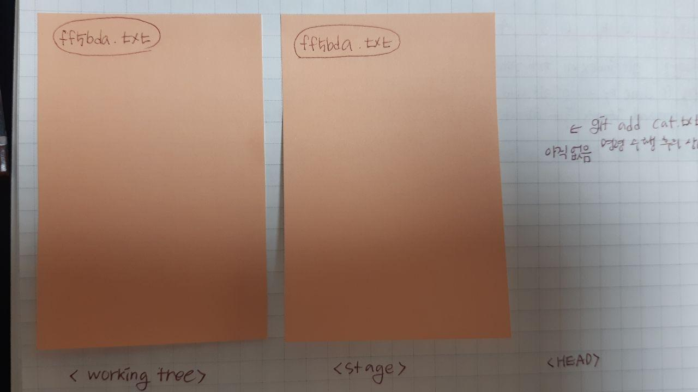

## 오늘의 할일

- [v] git add 명령의 동작 원리 알아보기

## git add 명령의 내부 동작 원리 알아보기

### CLI를 이용햬서 로컬저장소를 생성하고 파일을 스테이지에 추가하기

1 ) `git init` 다시 보기

- `Documnets` - `git-test` 폴더에서 `git init` 명령어로 로컬저장소 만들기
- `ls -al`명령어를 통해 `git-test`폴더의 숨김 파일 확인하기
- `ls -al .git` 명령어를 통해 `.git`의 숨김 파일 확인하기
  
- 위의 그림에서 의미를 파악하기
  |-rw-r--r--1|첫 번째 칸은 파일의 권한과 상태. '-'로 시작하면 일반 파일, 'd'로 시작하면 폴더|
  |-----|------------|
  |kimbomi|파일의 소유자 아이디|
  |23|파일의 크기, 바이트로 표시, 폴더는 0 표시|
  |4월 8 12:45|파일 생성 시간|
  |HEAD|파일 이름, 폴더의 경우 / 가 붙음|
  [ 출저 도서 팀 개발을 위한 Git, GitHub 시작하기]

### git add와 git status 다시 보기

| git hash-object <파일명> | 일반 파일의 체크섬을 확인                                                                                    |
| ------------------------ | ------------------------------------------------------------------------------------------------------------ |
| git show <커밋 체크섬>   | 해당 체크섬을 가진 객체의 내용 표시                                                                          |
| git ls-files --stage     | 스테이지 파일의 내용 표시. 스테이지 파일은 git add 명령을 통해 생성된다. .git/index 파일이 스테이지 파일이다 |

[ 출저 도서 팀 개발을 위한 Git, GitHub 시작하기]

1 ) `cat.txt` 파일 생성하기  
2 ) `git status` 명령어를 이용해서 워킹트리의 상태를 확인하기

- `cat.txt` 파일의 상태는 `Untracked`이다.
- `git status` 명령은 `워킹트리`,`스테이지`,`HEAD 커밋`의 저장 공간의 차이를 비교해서 보여준다.  
  
- `cat.txt`라는 새 파일을 생성하면, `워킹 트리`에만 해당 파일이 존재한다. 스테이지는 비어 있는 상태이고, HEAD 커밋은 없다.
- `cat.txt` 파일을 커밋하기 전에 `파일의 체크섬`을 확인 해보자. `git hash-object <파일명>`  
  

### 스테이지에 파일을 추가하기(git add 하기)

1 ) `git add cat.txt` : 파일 상태가 untracked인 cat.txt 파일을 스테이지에 추가한다
2 ) `git staus` : 스테이지에 성공적으로 추가된 것을 확인한다
3 ) `ls a .git` : `.git` 폴더에 `index`폴더 생성된 것을 확인한다.
4 ) `file .git/index` : `.git/index` 파일의 정보를 확인한다.
5 ) `git ls-files --stage` : 스테이지의 파일의 내용 확인한다.

- 스테이지에 들어가기 전 `cat.txt`의 커밋체크섬과 스테이지에 올라간 파일의 내용을 확인한다. 그리고 커밋체크섬값이 같음을 알 수 있다.
  
- `.git` 폴더를 더 살펴보자.
  1 ) `ls -a .git/objects/ff`명령어를 통해 objects 폴더를 확인한다.
  2 ) `git show ff5bda` : ff5ba 커밋체크섬 가진 객체의 내용을 확인한다. 즉, objects 폴더 안에 존재하는 파일은 Git 객체이다.
  
  3 ) `git status` : 워킹트리, 스테이지, HEAD 커밋의 상태를 확인한다
  

#### 체크섬을 이용해서 객체의 종류 및 내용 확인하는 명령어

| git cat-file -t <체크섬>         | 해당 체크섬을 가진 객체의 타입 확인                |
| -------------------------------- | -------------------------------------------------- |
| git cat-file <객체타입> <체크섬> | 객체의 타입을 알고 있을 때 해당 파일의 내용을 표시 |

[ 출저 도서 팀 개발을 위한 Git, GitHub 시작하기 ]

- `git cat-file -t ff5bda` : 체크섬으로 객체의 타입 확인하기
- blob 타입이다. binary large object의 줄임말이다.

## 정리

- 새로운 `cat.txt` 파일이 생성되면 워킹트리에 해당 파일이 존재한다. `cat.txt`파일의 상태는 `untracked`이다. 그리고 `git add cat.txt` 명령어를 수행하면 `cat.txt`파일이 스테이지에 추가된다. 그리고 `.git` 폴더에 `index` 폴더가 생성된다. `index` 폴더에 `cat.txt`파일이 있다. 그리고 동시에 `cat.txt`파일의 체크섬 값과 동일한 이름을 가진 blob 타입의 객체가 생성되면서 `.git/objects`에 저장된다.
