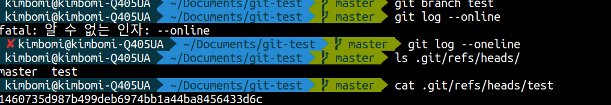
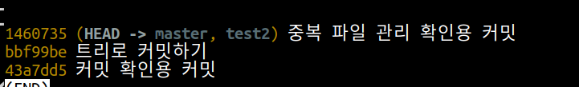
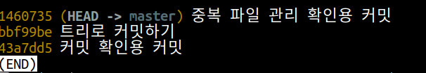
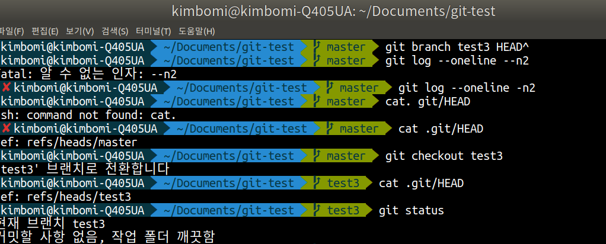

## 오늘의 할일

- [v] 브랜치 작동 원리 살펴보기

## 브랜치 생성하기

1 ) `test` 브랜치 생성하기 : `git branch test` 명령을 수행하면 커밋을 따로 지정하지 않으면 현재 `HEAD`커밋으로부터 `test` 브랜치가 생성된다.

2 ) `test` 브랜치 확인하기 : `git log --oneline` 명령으로 `HEAD`커밋과 같은 커밋을 참조하고 있다.

3 ) `ls .git/refs/heads/` : 해당 폴더에서 `master`와 `test` 파일을 확인할 수 있다.

4 ) `cat .git/refs/heads/test` : `test` 파일의 내용을 확인해보면 `test`브랜치가 가리키는 커밋을 확인할 수 있다. 해당 파일의 내용은 `HEAD` 커밋의 전체 체크섬 내용이 같음을 알 수 있다.

즉, `git branch <브랜치 이름> <커밋 체크섬>` 명령을 실행하면 내부적으로 커밋 체크섬 내용을 가지는 `.git/refs/heads/test 텍스트 파일`이 생성된다. 또한 `git branch -d <브랜치 이름>` 명령을 실행하면 브랜치가 삭제가 되는데, `.git/refs/heads/`에 있는 브랜치 파일이 삭제된다.

## 브랜치 삭제하기

1 ) `test` 브랜치 삭제하기 : `git branch -d test`  
2 ) `test` 브랜치가 삭제가 되었는지 브랜치 목록 확인하기 : `ls .git/refs/head/`  
3 ) 해당 브랜치를 수동으로 삭제하기 위해 `test2` 브랜치 생성하기 : `git branch test2`  
4 ) 브랜치 목록 확인하기 : `ls .git/refs/head/`  
5 ) `test2` 브랜치는 브랜치 생성시 따로 커밋을 지정하지 않았기 때문에 `HEAD`커밋으로 부터 `test2` 브랜치가 생성된다.

6 ) 수동으로 `test2` 브랜치 삭제하기 : `rm .git/refs/haed/test2`  
7 ) `test2` 브랜치가 삭제 되었는지 확인하기

## 브랜치 체크아웃하기

1 ) 현재 HEAD의 부모 커밋으로부터 test3 브랜치를 생성한다. : `git branch test3 HEAD^` or `git branch test3 HEAD~`

2 ) 커밋 히스토리 확인하기 : `git log --oneline -n2`

3 ) 현재 `master` 브랜치 위치 확인하기 : `cat .git/HEAD`

4 ) `test3` 브랜치로 이동하기 : `git checkout test3`

5 ) 현재 `test3` 브랜치 위치 확인하기 : `cat .git/HEAD`

6 ) `test3` 브랜치의 워킹트리 확인하기 : `git status`

즉, 브랜치 체크아웃은 이동할 브랜치로 `HEAD`를 이동시키고, 스테이지와 워킹트리를 `HEAD`가리키는 커밋과 동일한 내용을 반영하는 것이다.
