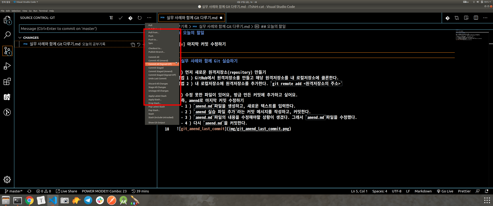
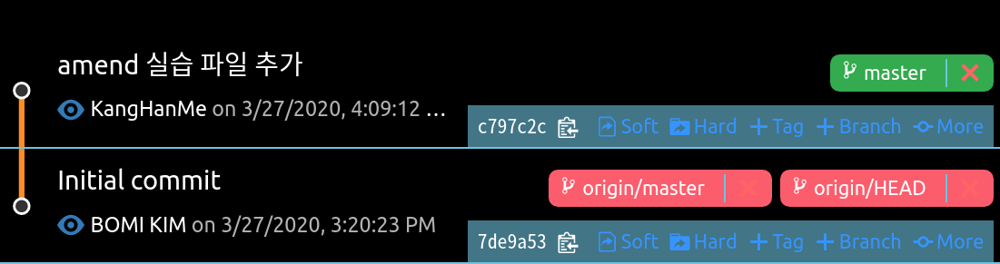
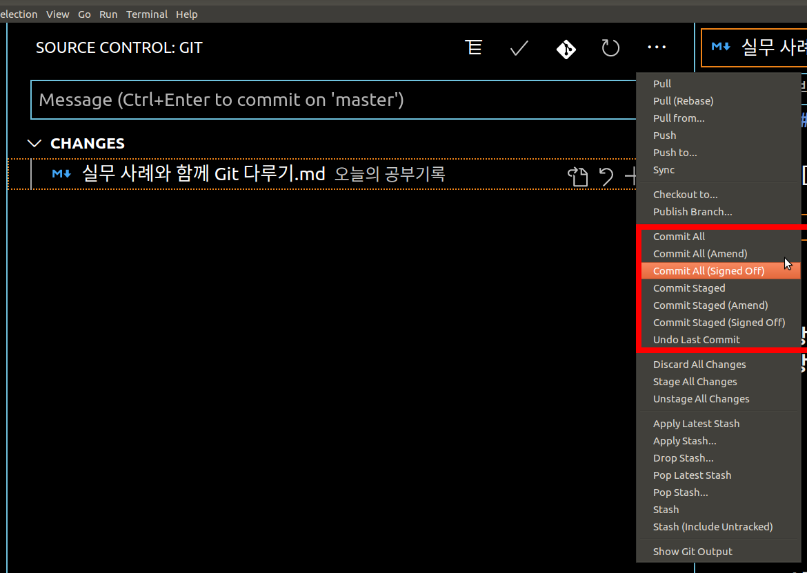
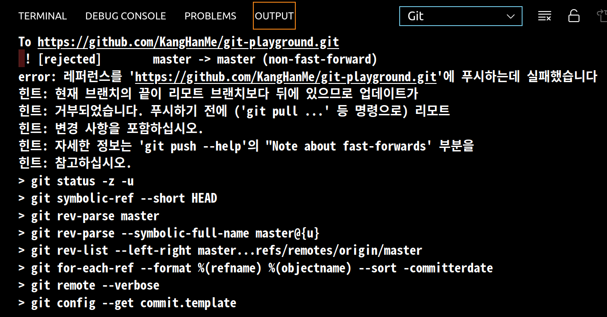

## 오늘의 할일

- [v] 마지막 커밋 수정하기
- [v] 수정한 커밋을 원격저장소에 올리기


## 실무 사례와 함께 Git 실습하기

1 ) 먼저 새로운 원격저장소(repository) 만들기  
방법 1 ) GitHub에서 원격저장소를 만들고 해당 원격저장소를 내 로컬저장소에 클론한다.   
방법 2 ) 내 로컬저장소에 원격저장소를 추가한다. `git remote add <원격저장소의 주소>`   

2 ) 수정 못한 파일이 있어요, 방금 만든 커밋에 추가하고 싶다면?  
- 즉, amend로 마지막 커밋 수정하기
- 현재 상황은 로컬저장소에서 커밋을 하고, 커밋의 내용을 수정하는 것이다.   
    
2 - 1 ) `amend.md`파일을 생성하고, 새로운 텍스트를 입력한다.   
2 - 2 ) `amend 실습 파일 추가`라는 커밋 메시지를 작성하고, 커밋한다.   
2 - 3 ) `amend.md`파일의 내용을 수정해야할 상황이 생겼다. 그래서 `amend.md`파일을 수정했다.    

- 소스트리에서는 `[커밋 옵션]`을 통해 쉽게 설정할 수 있다.
- 위의 그림은 Git History에서 `Commit staged(amend)`이용해서 마지막 커밋을 수정할 수 있다. 기존 커밋이 덮어 씌워진다.   
     
2 - 5 ) 커밋 메시지 수정 여부를 선택할 수 있다. 커밋 메시지를 수정하거나 수정하지 않을 수도 있다. 일단 커밋 메시지를 수정하지 않는다.   
2 - 6 ) `amend.md`을 커밋한다.
   

3 ) amend로 마지막 커밋 메시지를 수정하고 원격저장소에 올리기   
3 - 1 ) `amend.md`을 원격저장소에 올린다.
3 - 1 - 1 ) 아래의 그림에서 `Commit Staged(Signed Off)` - `amend 실습 파일 추가 커밋 메시지 수정`이라는 커밋 메시지를 수정하고, 커밋한다.   

3 - 2 ) 원격저장소에 올리기   
- 원격저장소에 올리면 아래와 같은 에러가 나온다. 그래서 강제로 원격저장소에 올려야한다.
   
3 - 2 - 1 ) 강제로 원격저장소에 올리기   
```sh
$ git push origin mater --force-with-lease
```
- 아래 그림과 같이 커밋 메시지가 수정이되고, 그래프가 깔끔해졌다. 만약에 원격저장소에 올라간 커밋이있고, 커밋에 수정사항이 있어 수정을 하고 다시 커밋을 했다면 그래프에 수정한 커밋이 반영되어 그래프가 깔끔하지 않을 것이다.


## CLI 환경에서 마지막 커밋 수정하고 원격저장소에 올리기

- 마지막 커밋 수정하는 명령어    
```sh
$ git commit --amend
```
- 수정한 커밋 원격저장소에 올리기
```sh
$ git push origin master --force-with-lease
```