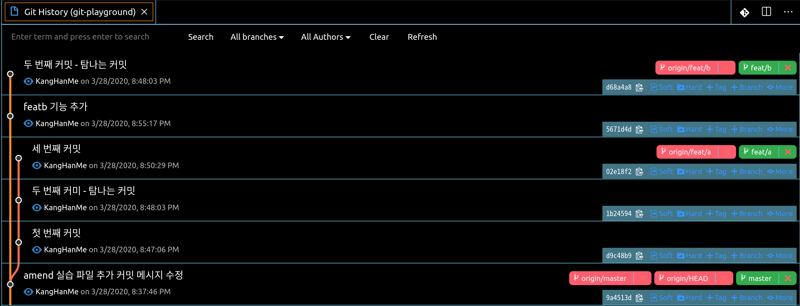
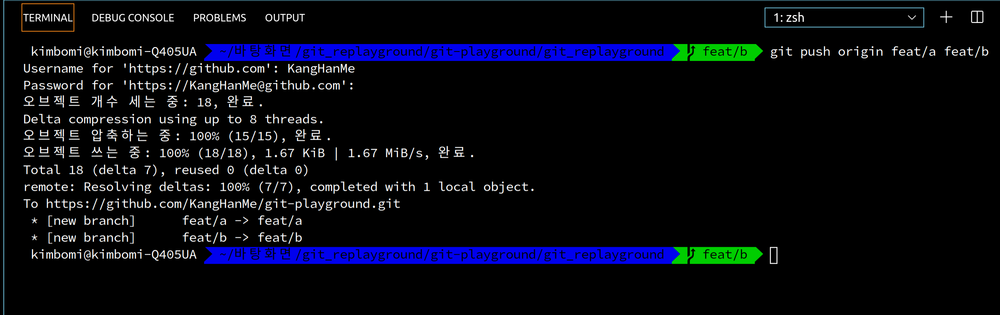
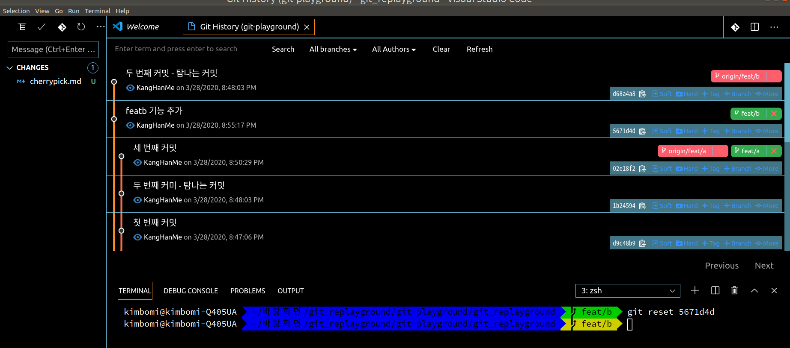
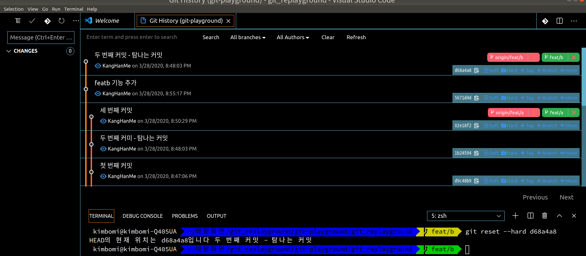
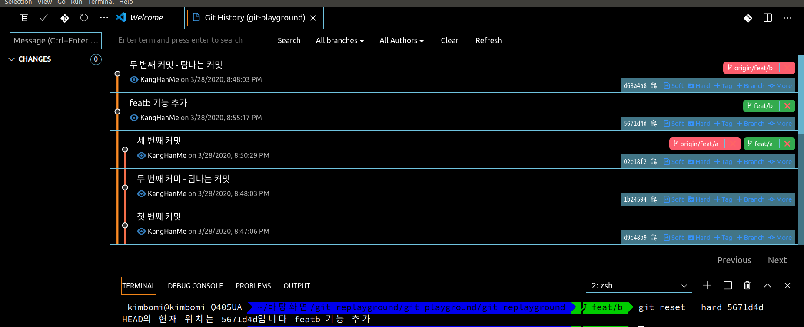
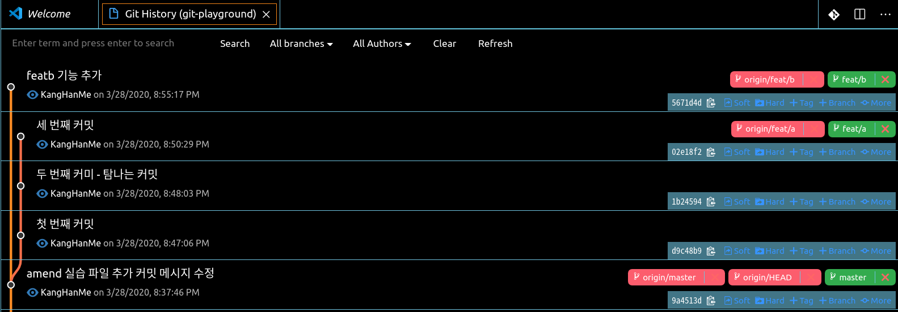

## 오늘의 할일

- [v] 옛날 커밋으로 브랜치를 되돌리기

## 용어 정리

## 옛날 커밋으로 브랜치를 되돌리는 실습하기

- 먼저, 옛날 커밋으로 브랜치를 되돌리기 위해서 `[feat/a]` 브랜치와`[feat/b]` 브랜치를 원격저장소에 올린다.
  
- `git push origin feat/a feat/b` 명령어를 통해서 여러가지 브랜치를 한 번에 원격저장소에 올리기
  
- 현재 `[feate/b]` 브랜치는 `두 번째 커밋 - 탐나는 커밋`에 있다. 이 브랜치를 `featb 기능 추가` 커밋으로 되돌려보자.
- 소스트리에서는 `featb 기능`에서 `[이 커밋까지 현재 브랜치를 초기화]`를 선택한다. 그리고 `Soft`,`Mixed`,`Hard` 옵션을 선택한다.
- Git History에서는 아래의 그림에서 되돌리고 싶은 커밋의 `[Soft]`와 `[Hard]`를 선택해서 되돌릴 수 있다
- 옵션 설명
- [Mixed] : 기본 옵션으로서 되돌아가기 전 커밋의 변경 사항이 stage에 올라기지 않은 상태이다. 그래서 원하는 변경 사항을 골라서 커밋에 추가할 수 있다.
- [Soft] : 되돌아가기 전 커밋의 변경 사항이 stage에 올라가 있는 상태이다. 그래서 바로 커밋을 할 수 있다.
- [Hard] : 되돌아가기 전 모든 변경 사항이 다 삭제된다.
- 변경된 사항을 원격 브랜치에 반영하기 위해서는 히스토리를 수정해서 올리는 것이기 때문에 `--force-with-lease` 옵션을 꼭 사용해야 한다. 단, 해당 브랜치는 다른 사람과 같이 사용하는 것이 아니여야 한다. 왜냐하면 다른 사람의 히스토리가 꼬이게 된다.

1 ) `git reset`에서 옵션 `[Mixed]`로 옛날 커밋으로 돌리기

- `[feate/b]` 브랜치는 `두 번째 커밋 - 탐나는 커밋`에 있다. 이 브랜치를 `[Mixed]`옵션으로 `featb 기능 추가` 커밋으로 되돌려보자. 참고로 `git reset <커밋아이디 7자리>`는 `[Mixed]`가 기본 옵션이다.
  

2 ) `git reset`에서 옵션 `[Hard]`로 옛날 커밋으로 돌리기

- `git reset --hard <커밋아이디 7자리>` 명령어를 이용해서 `두 번째 커밋 - 탐나는 커밋` 커밋으로 이동하기
  

- `git reset --hard <커밋아이디 7자리>` 명령어를 이용해서 `feat/b 기능 추가` 커밋으로 이동하기
  

3 ) `[feat/b]`브랜치에서 `[origin/feat/b]` 브랜치에 올리기

- 커밋의 히스토리를 수정하기 위해서 `강제푸시`해야한다.
  
