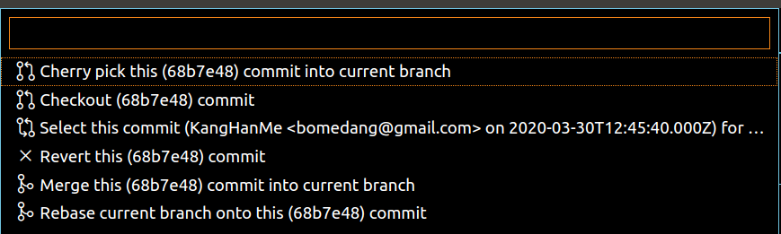
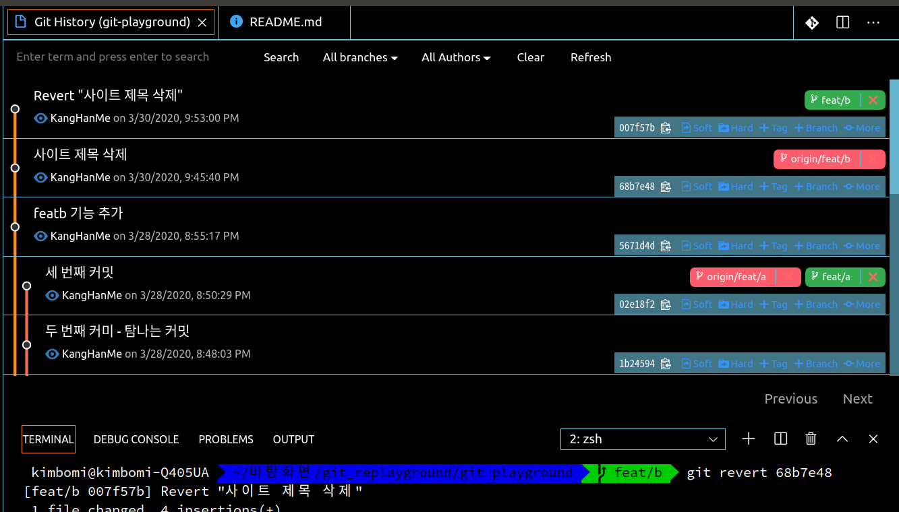

## 오늘의 할일

- [v] 커밋의 변경사항을 명시적으로 되돌리기

## 커밋의 변경사항을 되돌리는 실습하기

- `git reset`으로 옛날 커밋을 되돌아갈 수 있다. 특히, 커밋의 히스토리를 조작(없애는)된다. 하지만 다른 개발자와 함게 작업할 경우, 변경사항을 되돌리는 새로운 커밋을 만드는 것이 좋다. 예를 들면, `[feat/b]` 브랜치에서 'README.md`을 수정하고, 커밋한다. 그리고 원격저장소에 올린다. 해당 커밋의 변경사항 전으로 되돌려보자
- 소스 트리에서는 `[커밋 되돌리기]`를 선택하거나 Git Story에서 `[+ more]` - `[Revert this commit(커밋아이디 7자리)]` 선택한다.
  
- CLI 환경에서 `git revert <커밋 아이디>` 입력한다.
- 아래의 그림에서 변경사항 전 커밋이 새롭게 생겼다.
  
